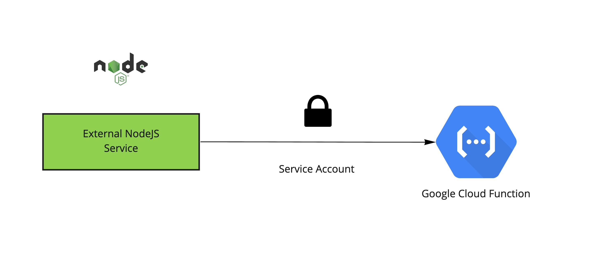

# Authenticate Google Cloud Function from any service via Service Account



## Requirements
- [gcloud](https://cloud.google.com/sdk/docs/install)
- [NodeJS 12+](https://nodejs.org/en/download/)

## Service Account
We need a Google Service Account with the permission to invoque cloud functions

### Create Service Account
```
gcloud iam service-accounts create service-1 \
    --description="My test Service Account" \
    --display-name="Service 1"
```
### Give Service account Cloud function invoker permission
```
gcloud projects add-iam-policy-binding chartwell-consulting \
    --member="serviceAccount:service-1@chartwell-consulting.iam.gserviceaccount.com" \
    --role="roles/cloudfunctions.invoker"
```

### Create JSON Key
```
gcloud iam service-accounts keys create /tmp/sa-private-key.json \
    --iam-account=service-1@chartwell-consulting.iam.gserviceaccount.com
```

### Installation

`mv env.txt .env`

Replace variables from `/tmp/sa-private-key.json` 
Example:
```
SERVICE_ACCOUNT_CLIENT_EMAIL="client_email from FILE"
SERVICE_ACCOUNT_PRIVATE_KEY="private_key FROM FILE"
SERVICE_ACCOUNT_AUDIENCE="Cloud function URL"
```

`npm install`

`node index.js`

Bearer Token Will be printed in the console:

```JSON
{
  access_token: undefined,
  token_type: 'Bearer',
  expiry_date: undefined,
  id_token: 'eyJhbGciOiJSUzI1NiIsImtpZCI6IjZlZjRiZDkwODU5MWY2OTdhOGE5Yjg5M2IwM2U2YTc3ZWIwNGU1MWYiLCJ0eXAiOiJKV1QifQ.eyJhdWQiOiJodHRwczovL2V1cm9wZS13ZXN0My1jaqweqweasdasdasdasdDkwODU5MWY2OTdhOGE5Yjg5M2IwM2U2YDkwODU5MWY2OTdhOGE5Yjg5M2IwM2U2YDkwODU5MWY2OTdhOGE5Yjg5M2IwM2U2YDkwODU5MWY2OTdhOGE5Yjg5M2IwM2U2Yasd123q3nqnwOtsx9fQYz0Vr4I_MxTUpWPSuQ0C4mKv7GJj1WgK2PsZWMFl8iOF0hTT2XHLnRAs6R-UAZYccK3CBidwkI88tYs7XsOD67ipSVRk6ap5Tx5J19GWs-pjZBgEwMq4IiBTPIgckXH9pnOah_Yi5Rt2cfmzFR1MrPs1GbD00eVahka2g',
  refresh_token: 'jwt-placeholder'
}
```

## Note

Make sure you deploy your cloud function with the newly created service account as:

```
gcloud functions deploy (...) --service-account=service-1@chartwell-consulting.iam.gserviceaccount.com
```